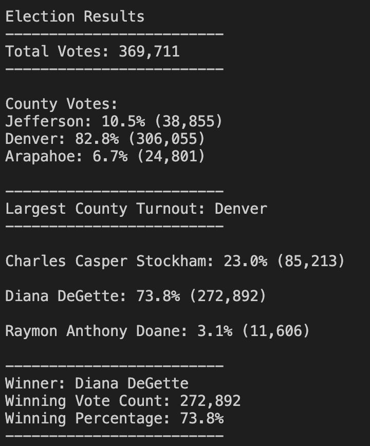

# Election_Analysis
Analysis of election results with python to read a csv file, providing the following deliverables:
1. Election results printed to command line
2. Election results saved to a text file
3. A written analysis of the election audit

## Project Overview
A Colorado Board of Elections employee has given the following tasks to complete the election audit of a recent local congressional election. 

* Calculate the total number of votes cast. 
* A complete list of candidates who received votes. 
* Calculate the toal number of votes each candidate won. 
* Calculate percentage of votes each candidate won. 
* Determine the winner of the election based on popular vote. 
* Determine voter turnout for each county
* Calculate percentage of votes from each county out of the total count
* Determine the county with the highest turnout

## Resouces 
- Data Source : election_results.csv
- Software: Python 3.6.1, Visual Sudio Code, 1.38.1

## Summary
The analysis of the election show that:
- There were "369,711" votes cast in the elections.
- The candidates were: 
  - Charles Casper Stockham
  - Diana DeGette
  - Raymon Anthony Doane
- The candidate results were :
  - Charles Casper Stockham received 23.0% of the vote and 85,213 votes. 
  - Diana DeGette received 73.8% of the votes and 272,892 votes. 
  - Raymon Anthony Doane received 3.1% of the votes and 11,606 votes.
- The winner of the election was Diana DeGette, who received 73.8% of the vote and 272,892 votes. 
- The counties were: 
  - Jefferson county
  - Denver county
  - Arapahoe county
- The county votes results were:
  - Jefferson county received 10.5% of the votes and 38,855 votes.
  - Denver county received 82.8% of the votes and 306,055 votes. 
  - Arapahoe county received 6.7% of the votes and 24,801 votes.
- The county with largest turnout in votes was Denver with 82.8% of the votes and 306,055 votes.

## Election Audit Summary
The python code provided can be used for any state election with the following:
1. separate csv files for each election 
2. separate election analysis txt file to record the results
3. counties and candidates can be changed to work for any state wide election

